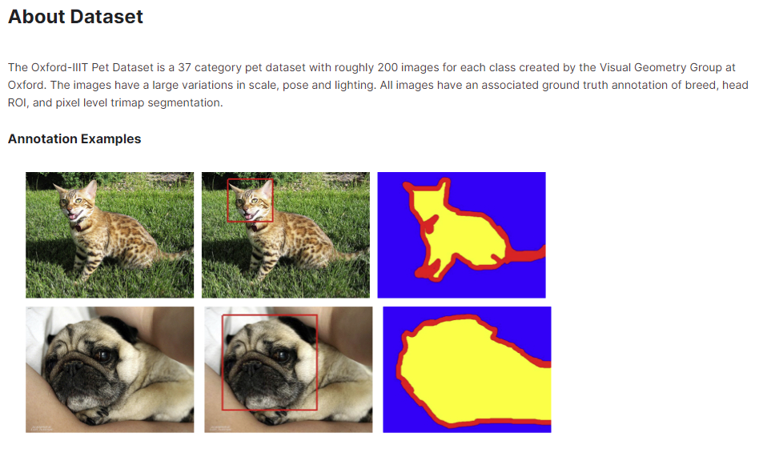
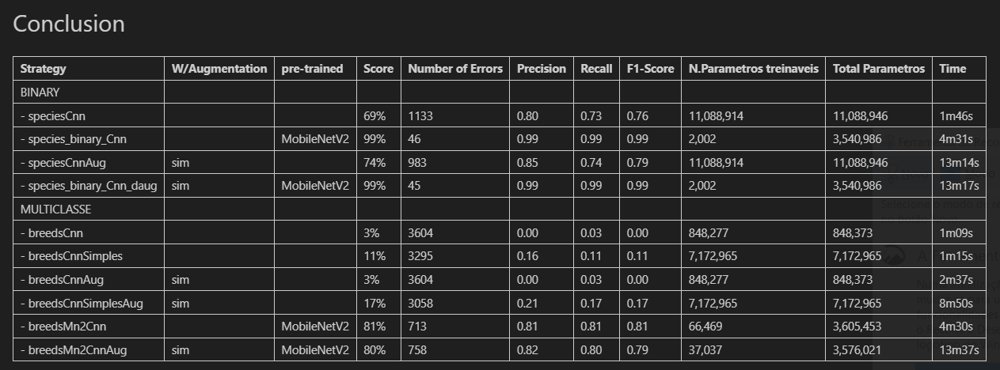

# Transfer_Learning_Oxford_iiiT_pet_Classification
This work consists of the binary (dog and cat) and multi-class (37 breeds) classification of images using convolutional neural networks (CNNs). For this purpose, the Oxford-IIIT Pet Dataset will be used.

You can see the data of this job in kaggle [ here. ]([URL](https://www.kaggle.com/datasets/tanlikesmath/the-oxfordiiit-pet-dataset)https://www.kaggle.com/datasets/tanlikesmath/the-oxfordiiit-pet-dataset)

